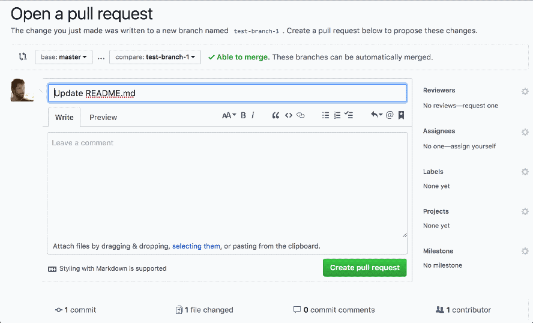

# wip-bot

[](https://greenkeeper.io/)

> DO NOT MERGE – as a service.



## Usage

- Install the app on your GitHub Repositories: [github.com/apps/wip](https://github.com/apps/wip)
- When creating a pull request that you don’t want to be merged, simply add the
  word "wip" or "WIP" somewhere in the pull request title
- The WIP bot will set/update the status of the pull request depending on the
  pull requests title.

## Local setup

- Setup repository

  ```
  git clone git@github.com:gr2m/wip-bot.git
  cd wip-bot
  npm install
  ```
- Create your own GitHub app: [instructions](https://probot.github.io/docs/development/#configure-a-github-app)
- Store the private key as `private-key.pem` in the repository’s directory
- Start the app with `APP_ID=1234 npm start` where `1234` is your GitHub App’s ID
- update your GitHub App’s `Webhook URL` to your localtunnle.me URL

## License

[Apache 2.0](LICENSE)
